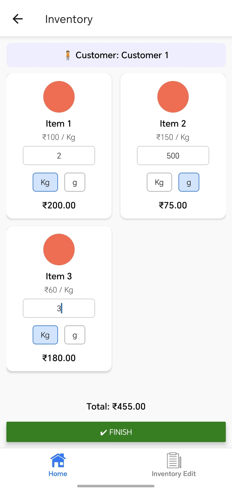
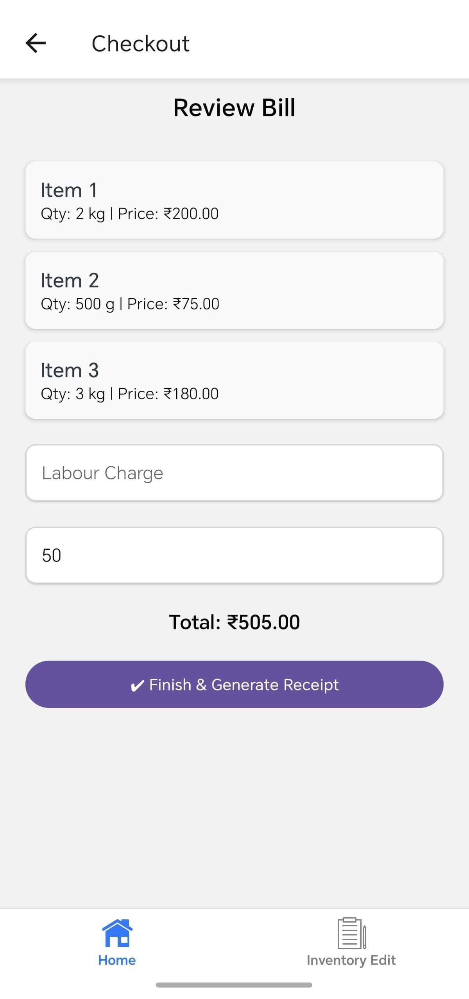
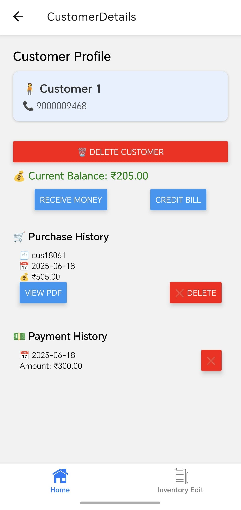

# 🧾Billing App

A lightweight Android billing application developed using **React Native (Bare Workflow)** and deployed via **Expo**.  
This version is purpose-built for My Father's Business and currently serves as the **initial release** of a more feature-rich system under development.

---

## 📢 Project Note

> ⚠️ **This is a basic version of the application.**  
> It currently handles inventory, customer management, and billing.  
> More advanced features like **live stock tracking, monthly expense/income reports**, and **customer WhatsApp/SMS alerts** are planned for future updates.

---

## 📱 Features

- 📦 Inventory Management – Add/edit/delete items with price and quantity
- 👥 Customer Management – View customer profiles, outstanding balances, and transaction history
- 💸 Checkout & Billing – Real-time bill creation with labor charge and old balance support
- 🧾 PDF Generation – Create, preview, and share receipts as PDF
- 💾 Local Storage – Offline data persistence using AsyncStorage
- 🎨 Clean UI – User-friendly interface with smooth workflow

---

## 🚀 Technologies Used

- React Native (Bare Workflow)
- JavaScript / JSX
- React Navigation
- React Native Paper
- AsyncStorage
- HTML-to-PDF
- Expo Modules (post-eject)

---

## ⚙️ Setup (For Developers)

### 🧰 Requirements

- Node.js ≥ 18  
- Java JDK ≥ 17  
- Android Studio (for device connection only)  
- Android phone (Expo Go app for testing)

### 🧪 Run Locally

```bash
git clone https://github.com/your-username/billing-app.git
cd billing-app
npm install
npx react-native start
````

Then scan the QR code with the **Expo Go** app to test it live on your device.

---

## 📦 Production APK

The current release is built and deployed through **Expo’s cloud build service**:

👉 **[Download the APK](https://expo.dev/accounts/spmar888/projects/KalapothFlourMill/builds/4d0d790c-510b-4c85-86a4-1b4e20365297)**

You can directly install this on any Android device.

---

## 🧭 Roadmap

Planned features in upcoming versions:

* 📊 Live stock quantity updates
* 🧾 Monthly expense & income reports
* 📲 WhatsApp and SMS alerts for customers
* ☁️ Optional data backup and restore
* 🛒 Purchase tracking module

---

## 📸 Screenshots

| Inventory                      | Checkout                      | Individual Customer Screen  |
| ------------------------------ | ----------------------------- | --------------------------  |
|  |  |   |

---

## 🙌 Author

Developed with ❤️ by [@Afthaab](https://github.com/4fthaab)
🧾 Built to support my Father's Business ' daily operations

> Suggestions and ideas are always welcome as the project grows!
